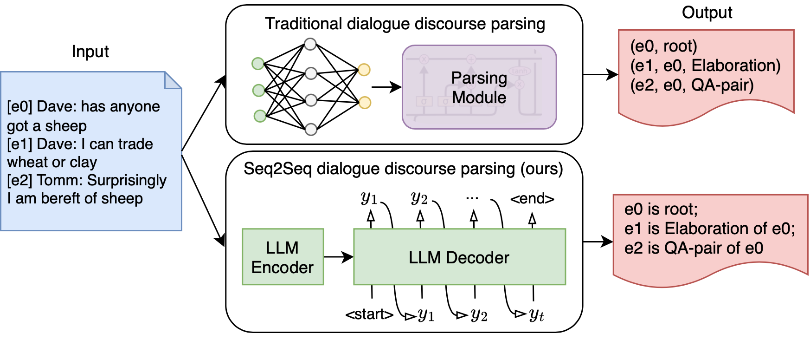

# Dialogue Discourse Parsing as Generation: a Sequence-to-Sequence LLM-based Approach

This is the source code repository for the paper Dialogue Discourse Parsing as Generation: a Sequence-to-Sequence LLM-based Approach ([SIGDial 2024](https://2024.sigdial.org)).



## Datasets
### STAC
We used the **linguistic-only** STAC corpus and followed the separation of train, dev, test in [Shi and Huang, A Deep Sequential Model for Discourse Parsing on Multi-Party Dialogues. In AAAI, 2019](https://github.com/shizhouxing/DialogueDiscourseParsing).
The latest available verison on the website is available [here](https://www.irit.fr/STAC/corpus.html). 
We share the dataset we used in `data/stac/`.


### Molweni
Download from [here](https://github.com/HIT-SCIR/Molweni). We use the original separation of train, dev, and test.
Download the dataset and place it in `data/molweni/`. 

## How to run
Here is a step-by-step guide to fine-tune a T5 family model for discourse parsing:

### Create a virtual environment
```
$ source virtualenvname/bin/activate
$ cd Seq2Seq-DDP/
$ pip install -r requirements.txt
```

### Prepare structured data for fine-tuning

In `dataprocess.py`: process the original stac/molweni dataset and convert the raw text to structured text.
Choose the structured text from: 
- Seq2Seq-DDP system: 'natural', 'augmented'
- Seq2Seq-DDP+transition system: 'focus', 'natural2'
Examples for each structure type are given in `data/stac_{structure}_train.json`.

Note that 'focus' and 'natural2' schemes come from 'natural' scheme. 
We provide the converted 'natural' format for your convenience.

### Fine-tuning

In `train.py`: give "do_train" as argument. 
This code fine-tunes a t5 familiy model for discourse parsing. 

### End2end prediction and transition-based prediction

- Seq2seq-DDP prediction: in `train.py`, give argument "do_test", choose structure type from 'augmented', 'natural'.
Make sure to first put the fine-tuned model checkpoint in `constant.py`. Results will be written in `generation/`.

- Seq2Seq-DDP+transition system prediction: in `transition_predict.py`: choose structure type from 'focus', 'natural2'.

- `evaluate.py`: Evaluate predicted files in `generation/` and calculate scores.

- `constant.py`: store paths, labels, etc.

## Citation
```
@inproceedings{li-etal-2024-dialogue,
    title = "Dialogue Discourse Parsing as Generation: A Sequence-to-Sequence {LLM}-based Approach",
    author = "Li, Chuyuan  and
      Yin, Yuwei  and
      Carenini, Giuseppe",
    editor = "Kawahara, Tatsuya  and
      Demberg, Vera  and
      Ultes, Stefan  and
      Inoue, Koji  and
      Mehri, Shikib  and
      Howcroft, David  and
      Komatani, Kazunori",
    booktitle = "Proceedings of the 25th Annual Meeting of the Special Interest Group on Discourse and Dialogue",
    month = sep,
    year = "2024",
    address = "Kyoto, Japan",
    publisher = "Association for Computational Linguistics",
    url = "https://aclanthology.org/2024.sigdial-1.1",
    doi = "10.18653/v1/2024.sigdial-1.1",
    pages = "1--14",
}
```